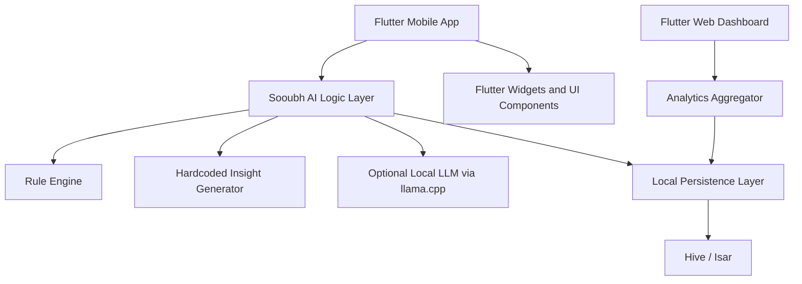
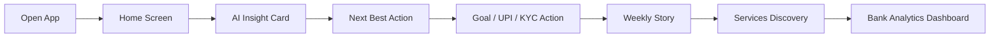
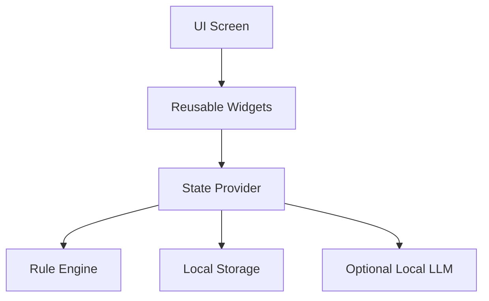
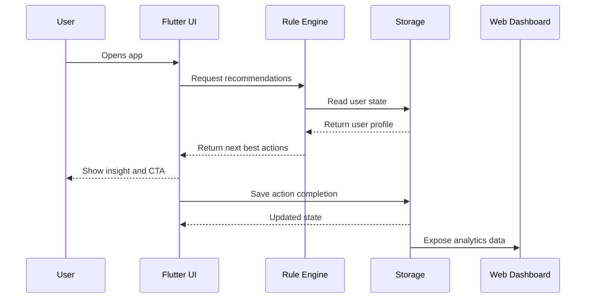

# Sooubh AI — Comprehensive Product, Requirements, and Technical Design Document

**Product Name:** Sooubh AI  
**Project Type:** Agentic engagement layer for YONO SBI-style banking journeys  
**Platform:** Flutter Mobile + Flutter Web  
**Hackathon:** SBI Hackathon  
**Prepared By:** Sourabh Singh  
**Document Status:** Draft v1.0  
**Purpose:** MVP definition for a working demo, polished UI/UX prototype, and innovation showcase

---

## 1. Document Purpose

This document combines the product definition, customer requirements, functional requirements, technical requirements, architecture, UX direction, mockups, data model, implementation plan, and demo strategy for **Sooubh AI**.

The goal is not to build a full production banking system.

The goal is to build a **hackathon-winning prototype** that clearly demonstrates:

- a working mobile app experience
- a companion Flutter web dashboard
- a rule-based and local-AI-assisted recommendation engine
- strong UI/UX
- agentic AI behavior
- measurable engagement and digital adoption value

Sooubh AI should feel like a smart layer on top of an existing banking app experience. It should not feel like a generic chatbot. It should guide users, surface the next best action, and make the banking app more discoverable.

---

## 2. Executive Summary

Most banking users open a banking app for one or two actions: check balance, send money, pay bills, and leave.

That behavior creates a major problem for banks:

- low digital adoption
- low feature discovery
- weak retention
- low engagement
- missed cross-sell and up-sell opportunities
- poor usage of premium and long-tail banking features

**Sooubh AI** solves this by adding an **agentic engagement layer** on top of the banking experience.

Instead of waiting for users to search for features, Sooubh AI proactively:

- recommends the next best action
- highlights unused services
- guides first-time onboarding
- shows financial progress
- creates a weekly story
- nudges users toward useful banking behaviors
- helps users discover services naturally
- gives bank-side analytics through a web dashboard

For the hackathon, this is a very strong solution because it directly maps to the judging priorities:

- working demo
- prototype quality
- UI/UX
- innovation

---

## 3. Product Vision

### One-line vision
**Sooubh AI turns a transactional banking app into a proactive financial engagement experience.**

### Product positioning
- YONO SBI provides banking tools
- Sooubh AI helps users discover and use them
- YONO SBI is reactive
- Sooubh AI is proactive
- YONO SBI shows functionality
- Sooubh AI drives adoption and engagement

### Why this matters
The bank already has the features.
The missing layer is intelligent guidance.

Sooubh AI fills that gap.

---

## 4. Problem Statement

### Current user pattern
A typical banking user:

1. opens the app
2. checks balance
3. transfers money or pays a bill
4. exits the app

### Why this happens
- users do not know what else is available
- important services are hidden behind menus
- there is no personalized guidance
- no visible progress or reward loop
- onboarding is static
- the app does not tell the user what to do next

### Business consequence
- low feature adoption
- low repeat usage
- low product discovery
- weak engagement
- users remain under-activated
- bank services are underutilized

### User consequence
- the app feels like a tool, not a companion
- banking remains a chore
- the user sees balance, not progress
- the user misses opportunities to save, invest, and build financial habits

---

## 5. Solution Overview

Sooubh AI creates a smart layer above the banking experience.

It analyzes basic user state and then shows contextual recommendations.

### Example behaviors
- if KYC is incomplete, suggest KYC completion
- if UPI is not enabled, suggest UPI setup
- if the user has no goal, suggest a savings goal
- if the user has not explored investments, suggest a beginner SIP
- if the user has not used insurance or recurring deposit features, recommend those
- if the user is active, show weekly progress
- if the user is new, guide onboarding step by step

### Core outputs of the system
- next best action
- smart onboarding
- financial health score
- weekly story
- feature discovery nudges
- AI service search
- AI chat assistant
- bank-side analytics dashboard

---

## 6. Hackathon Fit

Sooubh AI directly addresses the SBI hackathon focus areas:

### Customer Acquisition
New users are guided through a cleaner onboarding experience, creating a stronger first impression and reducing friction.

### Digital Adoption
The app nudges users toward underused banking capabilities such as UPI activation, savings goals, recurring deposits, investments, and insurance.

### Digital Engagement
The app keeps users returning through a financial health score, weekly story, progress tracking, and smart recommendations.

---

## 7. Product Goals

### Primary goals
1. Build a clean, high-quality Flutter mobile prototype.
2. Build a companion Flutter web dashboard.
3. Demonstrate visible AI behavior using a rule engine, hardcoded insights, and optional local LLM support.
4. Make the product look polished enough for a hackathon demo.
5. Show that the product increases engagement and feature discovery.

### Secondary goals
1. Create a reusable design system.
2. Keep the codebase modular and easy to extend.
3. Make the demo flow easy to explain in under five minutes.
4. Support offline or semi-offline local AI behavior for demo resilience.

---

## 8. Scope

### In scope for MVP
- Flutter mobile app
- Flutter web dashboard
- home screen
- accounts screen
- services screen
- menu screen
- onboarding journey
- goal tracking
- financial health score
- weekly story
- rule-based recommendation engine
- local AI chat stub
- optional llama.cpp model support
- analytics dashboard for adoption and engagement

### Out of scope for MVP
- real SBI core banking integration
- real transaction processing
- real KYC verification
- production authentication
- real payment rails
- real backend banking APIs
- legal/compliance productionization
- live deployment to bank systems

The prototype should simulate banking intelligence, not implement real banking infrastructure.

---

## 9. Target Users

### 9.1 Primary user: existing SBI digital customer
- already uses the banking app
- checks balance frequently
- uses UPI or transfers money
- rarely explores investment or insurance features
- is likely to respond to nudges and simple goal systems

### 9.2 Secondary user: new account holder
- opened a new account
- needs guided setup
- has not completed digital onboarding
- benefits from step-by-step assistance

### 9.3 Bank-side user: digital banking team
- wants analytics on adoption
- monitors feature usage
- views funnel performance
- tracks recommendation effectiveness

---

## 10. Product Principles

### 10.1 Layer, not replacement
Sooubh AI should sit on top of the existing banking structure instead of replacing it.

### 10.2 Trust first
Banking software must feel safe, stable, and credible.

### 10.3 Short and clear
AI-generated text must be short, readable, and action-oriented.

### 10.4 Context-aware
Every recommendation should match the user state.

### 10.5 Visually calm but intelligent
The interface should feel premium, uncluttered, and easy to understand.

---

## 11. Core Product Story

### Current behavior
User opens app -> checks balance -> leaves

### Target behavior
User opens app -> sees insight -> sees next best action -> takes action -> sees progress -> comes back again

This is the engagement loop Sooubh AI must create.

---

# 12. Functional Requirements

---

## 12.1 Home Screen

### Purpose
The Home Screen is the primary engagement entry point. It should immediately show the user that the app understands them.

### Required elements
- balance card
- quick actions
- financial health score
- Sooubh AI insight card
- next best action cards
- active goal card
- weekly story preview
- contextual nudges

### Behavioral rules
- always show at least one recommendation
- show at most three visible action suggestions
- hide completed onboarding suggestions
- use very short copy
- maintain clean spacing and alignment
- prioritize high-value actions above low-value ones

### Example recommendations
- Enable UPI
- Complete KYC
- Create Emergency Fund
- Start first SIP
- Add nominee
- Explore FD
- Set debit card controls

---

## 12.2 Accounts Screen

### Purpose
The Accounts Screen gives a financial overview and helps the user understand spending patterns.

### Required elements
- account summary
- masked account number
- available balance
- transaction history
- spending chart
- goal-linked savings
- savings insight card

### Behavioral rules
- show recent transactions with categories
- provide simple filters for date/category/type
- keep insights to one or two lines
- avoid dense tables on mobile
- chart should be readable at a glance

---

## 12.3 Services Screen

### Purpose
The Services Screen is the digital adoption engine.

### Required elements
- Sooubh Search
- Sooubh Chat
- services grid
- category cards
- discovery badges
- “new” or “recommended” indicators

### Required categories
- payments
- accounts
- investments
- loans
- insurance

### Behavioral rules
- show “not explored” badges where relevant
- AI should recommend services based on user profile
- search should return contextual service shortcuts
- chat should surface common prompts
- keep the interface visually simple

---

## 12.4 Menu Screen

### Purpose
The Menu Screen keeps the app complete and organized.

### Required elements
- profile
- settings
- security center
- help and support
- rewards
- offers
- locator
- AI assistant shortcut

### Behavioral rules
- use clear grouping
- keep advanced settings separated
- support quick access to system tools
- preserve banking trust

---

## 12.5 Smart Onboarding Journey

### Purpose
Guide new users through setup and activation.

### Required steps
1. setup account preferences
2. enable UPI
3. add nominee
4. secure account
5. create first goal
6. explore services

### Behavioral rules
- show progress status
- show completed and incomplete steps
- suggest one step at a time
- reduce friction
- make the process feel like a mission rather than a form

---

## 12.6 Financial Health Score

### Purpose
Create a simple wellness metric that makes the app feel alive.

### Score range
0 to 100

### Example factors
- savings consistency
- spending discipline
- goal progress
- investment activity
- bill payment behavior

### Display
- circular score ring
- score number in center
- short status label
- tap for breakdown

---

## 12.7 Weekly Story

### Purpose
Create a recurring engagement loop similar to social media story formats.

### Content
- saved this week
- spending trend
- goal progress
- score change
- best insight
- recommended next step

### Behavior
- show once per week
- present as tappable story cards
- allow swipe-based progression
- include a short recap and one action suggestion

---

## 12.8 Goal Tracker

### Purpose
Make the app emotionally relevant.

### Goal types
- emergency fund
- travel fund
- education fund
- wedding fund
- home savings

### Required fields
- goal name
- target amount
- saved amount
- progress percentage
- monthly contribution suggestion
- estimated completion timeline

---

## 12.9 AI Discovery Engine

### Purpose
Show the user services they have not used yet.

### Capabilities
- detect unused features
- label features as explored or not explored
- recommend relevant services
- show activation prompts instead of empty navigation

### Example
If the user has never opened the FD section, Sooubh AI should suggest:
“Start a fixed deposit with idle savings.”

---

# 13. Non-Functional Requirements

## 13.1 Performance
- the app should open quickly
- screen transitions should feel smooth
- charts and cards should render without lag
- local AI fallback should be fast

## 13.2 Reliability
- the demo should not depend on live internet for core behavior
- rule engine must work offline
- local demo data must be available at startup

## 13.3 Usability
- users should understand the app in under 30 seconds
- important actions should be visible immediately
- navigation should be simple and predictable

## 13.4 Maintainability
- code should be modular
- screens should be separated by feature
- local logic should be easy to extend
- UI should use reusable components

## 13.5 Security
- mock banking values should not resemble real account data
- sensitive flows should be simulated
- model import should be controlled
- local storage should avoid sensitive production claims

---

# 14. UX and UI Direction

## 14.1 Overall style
- white theme
- premium banking look
- blue primary palette
- subtle teal accent for AI
- soft shadows
- rounded corners
- spacious alignment
- minimal text
- clear hierarchy

## 14.2 Design intent
The interface should feel:
- modern
- calm
- structured
- bank-grade
- non-cluttered

## 14.3 What to avoid
- heavy text blocks
- crowded cards
- too many colors
- playful branding
- overly technical labels
- random AI animations that distract

---

# 15. Screen Mockups

The mockups below are conceptual references for implementation.

---

## 15.1 Home Screen Mockup

```text
┌─────────────────────────────────────┐
│  Good Morning, Sourabh        🔔    │
│  Sooubh AI                         ⋮ │
│                                     │
│  ┌──────── Balance Card ────────┐   │
│  │ ₹ 1,24,500                   │   │
│  │ Savings Account · •••• 4821   │   │
│  └───────────────────────────────┘   │
│                                     │
│  Quick Actions                      │
│  [Send] [Scan] [Pay] [Request]      │
│                                     │
│  ┌──── Financial Health ────────┐   │
│  │ 86/100                        │   │
│  │ Good financial health         │   │
│  └───────────────────────────────┘   │
│                                     │
│  ┌──── Sooubh Insight ───────────┐   │
│  │ You saved ₹1,200 more this    │   │
│  │ week than last week.          │   │
│  └───────────────────────────────┘   │
│                                     │
│  Next Best Actions                  │
│  ┌ Create Goal ──────────────────┐   │
│  ┌ Enable UPI ───────────────────┐   │
│  ┌ Start FD ─────────────────────┐   │
│                                     │
│  ┌──── Weekly Story ──────────────┐   │
│  │ Tap to view your week         │   │
│  └───────────────────────────────┘   │
└─────────────────────────────────────┘
```

---

## 15.2 Accounts Screen Mockup

```text
┌─────────────────────────────────────┐
│ Accounts                      🔍    │
│                                     │
│ ┌──────── Account Summary ────────┐  │
│ │ Savings Account                 │  │
│ │ ₹ 1,24,500                      │  │
│ │ Available balance               │  │
│ └─────────────────────────────────┘  │
│                                     │
│ Spending Overview                   │
│ [Chart: Food, Bills, Travel, etc.]  │
│                                     │
│ Recent Transactions                 │
│ • Swiggy            -₹240          │
│ • Salary           +₹50,000        │
│ • Electricity       -₹1,250        │
│                                     │
│ ┌──── Savings Insight ────────────┐  │
│ │ Food spending is up 8%.         │  │
│ └─────────────────────────────────┘  │
│                                     │
│ ┌──── Goal Tracker ───────────────┐  │
│ │ Emergency Fund 72%             │  │
│ └─────────────────────────────────┘  │
└─────────────────────────────────────┘
```

---

## 15.3 Services Screen Mockup

```text
┌─────────────────────────────────────┐
│ Services                     ⋮      │
│                                     │
│ ┌──────── Sooubh Search ────────┐   │
│ │ Search services, loans, FD... │   │
│ └───────────────────────────────┘   │
│ [Sooubh Chat]                       │
│                                     │
│ Payments                            │
│ [UPI] [Bill Pay] [Recharge]        │
│                                     │
│ Accounts                            │
│ [FD] [RD] [PPF]                    │
│                                     │
│ Investments                         │
│ [SIP] [MF] [NPS]                   │
│                                     │
│ Loans                               │
│ [Home] [Personal] [Car]            │
│                                     │
│ Insurance                           │
│ [Life] [Health] [Motor]            │
└─────────────────────────────────────┘
```

---

## 15.4 Menu Screen Mockup

```text
┌─────────────────────────────────────┐
│ Menu                                │
│                                     │
│ Profile                             │
│ Settings                            │
│ Security Center                     │
│ Help & Support                      │
│ Rewards                             │
│ Offers                              │
│ Locator                             │
│ Sooubh AI Assistant                 │
└─────────────────────────────────────┘
```

---

## 15.5 Web Dashboard Mockup

```text
┌─────────────────────────────────────────────────────────────┐
│ Sooubh AI Dashboard                                         │
│                                                             │
│ KPIs                                                        │
│ [Active Users] [DAU] [Adoption Rate] [AI Accept Rate]       │
│                                                             │
│ Adoption Funnel                                             │
│ Registered → UPI Enabled → Goal Created → SIP Started      │
│                                                             │
│ Engagement Trend                                            │
│ [Line chart]                                                │
│                                                             │
│ Feature Discovery                                           │
│ Most Used / Least Used                                      │
│                                                             │
│ AI Recommendations                                          │
│ Generated / Clicked / Completed                             │
└─────────────────────────────────────────────────────────────┘
```

---

# 16. Technical Architecture

## 16.1 High-level architecture



---

## 16.2 Architecture explanation

### Flutter Mobile App
The mobile app is the main demo surface. It includes all user-facing banking-like screens and AI-driven engagement logic.

### Sooubh AI Logic Layer
This is the intelligence layer that decides what content to show.

### Rule Engine
This is the primary AI behavior for the hackathon. It is deterministic and safe.

### Hardcoded Insight Generator
This produces realistic-feeling AI text even without a full model.

### Optional Local LLM
If a local model is available, the app can use llama.cpp to generate more dynamic responses.

### Local Persistence Layer
Stores onboarding progress, goals, recommendations, and mock financial state.

### Flutter Web Dashboard
Provides analytics for the bank-side demo.

---

# 17. AI / Intelligence Design

## 17.1 AI strategy for the demo
Because the focus is a working prototype, the AI should be hybrid.

### Layer A — Rule-based engine
This is the core decision layer.

Example rules:
- if onboarding incomplete, show onboarding tasks
- if no goal exists, suggest a goal
- if UPI inactive, suggest UPI setup
- if investment unused, suggest SIP
- if user is active, show weekly story

### Layer B — Hardcoded dynamic content
This layer uses prebuilt templates and randomized values.

Example:
- “You saved ₹1,200 more this week.”
- “Your spending dropped by 8%.”
- “You are 72% closer to your goal.”

### Layer C — Optional local model
If the user imports a GGUF model, Sooubh AI can use it for chat and explanation surfaces.

### Layer D — fallback model
If no local model is available, the app still behaves intelligently through rules and templates.

---

## 17.2 llama.cpp support

### Purpose
To show that the app supports on-device or local AI functionality without depending fully on cloud APIs.

### Required capabilities
- download model
- import model file
- select active model
- run chat prompts
- show model status
- fall back gracefully when no model is available

### Supported file type
- `.gguf`

### Demo-safe approach
Use the local model only for:
- chat examples
- explanation responses
- summary cards

Do not depend on it for every screen.

---

# 18. Data Model

Below is the simplified MVP data model.

---

## 18.1 User profile

```json
{
  "userId": "u001",
  "name": "Sourabh",
  "maskedAccount": "•••• 4821",
  "kycComplete": false,
  "upiEnabled": false,
  "hasGoal": true,
  "goalCount": 1,
  "financialHealthScore": 86,
  "lastLogin": "2026-06-18",
  "newUser": false
}
```

---

## 18.2 Goal model

```json
{
  "id": "g001",
  "name": "Emergency Fund",
  "targetAmount": 50000,
  "savedAmount": 36000,
  "progress": 72,
  "monthlyContribution": 4000,
  "status": "active"
}
```

---

## 18.3 Recommendation model

```json
{
  "id": "r001",
  "type": "next_best_action",
  "title": "Enable UPI",
  "subtitle": "Set up UPI to start fast payments.",
  "priority": 1,
  "completed": false,
  "actionRoute": "/services/upi"
}
```

---

## 18.4 Weekly story model

```json
{
  "weekStart": "2026-06-10",
  "weekEnd": "2026-06-16",
  "savedThisWeek": 1200,
  "spendChangePercent": -8,
  "goalProgressChange": 5,
  "scoreChange": 3,
  "summaryText": "You saved more and spent less this week."
}
```

---

## 18.5 Service model

```json
{
  "id": "svc_fd",
  "name": "Fixed Deposit",
  "category": "Accounts",
  "isNew": true,
  "isActivated": false,
  "badge": "Recommended"
}
```

---

# 19. Rule Engine Specification

## 19.1 Rule priority order
The engine should evaluate in this order:

1. onboarding-critical actions
2. account/security actions
3. savings and goals
4. investments
5. discovery nudges
6. weekly story / engagement content

## 19.2 Example rules

```text
IF user.kycComplete == false
THEN show "Complete KYC"

IF user.upiEnabled == false
THEN show "Enable UPI"

IF user.hasGoal == false
THEN show "Create Emergency Fund"

IF user.financialHealthScore < 50
THEN show "Improve savings habit"

IF user.goalCount > 0
THEN show "View goal progress"

IF user.hasNotUsedInvestment == true
THEN show "Start SIP"
```

## 19.3 Rule output
Each rule should produce:
- title
- short subtitle
- icon
- CTA label
- route
- priority
- completion state

---

# 20. Navigation Structure

## 20.1 Mobile navigation
Recommended bottom navigation tabs:
- Home
- Accounts
- Services
- Menu

## 20.2 Special flows
- Home → Goal Creation
- Home → Weekly Story
- Services → AI Chat
- Services → Search Result
- Menu → Settings
- Menu → Security Center

## 20.3 Web navigation
- Overview
- Adoption Funnel
- Engagement Analytics
- Recommendations
- Feature Discovery
- Model Status

---

# 21. Component Library

Reusable Flutter components should include:

- `BalanceCard`
- `QuickActionRow`
- `HealthScoreRing`
- `InsightCard`
- `RecommendationCard`
- `GoalProgressCard`
- `StoryCard`
- `ServiceTile`
- `SearchBar`
- `ChatLauncherButton`
- `AnalyticsMetricCard`
- `FunnelChartPanel`
- `SectionHeader`

Each component should be self-contained, highly reusable, and visually consistent.

---

# 22. State Management Plan

## 22.1 Why Riverpod
Riverpod is a good fit because it is:
- lightweight
- testable
- easy to modularize
- good for local state and async loading
- suitable for Flutter mobile and web

## 22.2 State domains
- user state
- onboarding state
- recommendations state
- goals state
- services exploration state
- weekly story state
- local model state
- analytics state

---

# 23. Local Storage Strategy

## Option A: Hive
Good for quick MVP key-value persistence.

## Option B: Isar
Better for structured objects and local querying.

## Stored data
- user profile
- onboarding steps
- recommendations
- goals
- weekly story snapshots
- service interaction history
- model selection state

## Recommendation for hackathon
Use the simplest stable local storage option you are most comfortable with.

---

# 24. Tech Stack

## 24.1 Mobile and web frontend
- Flutter
- Dart
- Material 3
- Flutter Web

## 24.2 State management
- Riverpod

## 24.3 Local persistence
- Hive or Isar

## 24.4 Charts
- fl_chart

## 24.5 Animations
- flutter_animate
- lottie
- rive where useful

## 24.6 Local AI support
- llama.cpp integration
- GGUF model import
- local model downloader

## 24.7 UI utilities
- custom theming
- reusable widgets
- responsive layout helpers

## 24.8 Optional backend for analytics simulation
- Firebase
- Supabase
- or fully local mock data, depending on build speed

For the hackathon, local mock data is enough if it is well designed.

---

# 25. Build Structure

Suggested folder structure:

```text
lib/
  core/
    theme/
    constants/
    utils/
    widgets/
    routing/
  features/
    home/
      presentation/
      state/
      widgets/
    accounts/
      presentation/
      state/
      widgets/
    services/
      presentation/
      state/
      widgets/
    menu/
      presentation/
      state/
      widgets/
    goals/
      presentation/
      state/
      widgets/
    ai/
      presentation/
      engine/
      widgets/
    analytics/
      presentation/
      state/
      widgets/
  data/
    models/
    repositories/
    mock/
  app.dart
  main.dart
```

---

# 26. Web Dashboard Requirements

The Flutter web dashboard is not just a UI extension. It is a key part of the innovation story.

## Purpose
To show the bank-side value of the product.

## Dashboard modules
- user engagement overview
- adoption funnel
- recommendation engine metrics
- feature discovery analytics
- financial health trend
- onboarding completion rates
- model status
- suggestion acceptance rates

## KPIs to display
- total users
- active users
- average session length
- recommendation CTR
- completion rate
- onboarding drop-off rate
- most explored services
- least explored services

---

# 27. Demo Logic

The demo should be staged carefully.

## Demo scenario
1. user opens the app
2. home screen shows health score and recommendation
3. user sees that UPI is not enabled
4. user taps next best action
5. onboarding progress advances
6. user creates a goal
7. weekly story shows progress
8. services screen highlights untried features
9. AI chat explains a product
10. web dashboard shows adoption metrics changing

## Why this works
It creates a story:
- problem
- intelligence
- action
- engagement
- analytics

That is a hackathon-friendly arc.

---

# 28. Demo Data Strategy

For hackathon reliability, the app should not depend on real banking data.

Use seeded mock data:
- predefined user profiles
- predefined transaction lists
- predefined goals
- predefined weekly stories
- predefined recommendations
- predefined service discovery states

This ensures the demo always works.

---

# 29. Recommended Mock User Profiles

## Profile 1: New user
- KYC incomplete
- UPI not active
- no goal
- strong onboarding nudges

## Profile 2: Existing user
- UPI active
- has a savings goal
- moderate score
- weekly story visible

## Profile 3: Power user
- investment suggestions
- insurance nudges
- advanced features promoted

These profiles help you demo different recommendation behaviors.

---

# 30. Mock UI Content Examples

## Insight examples
- “You saved more this week.”
- “Your spending dropped by 8%.”
- “You are close to your goal.”
- “Try auto-save to grow faster.”

## Action examples
- “Complete KYC”
- “Enable UPI”
- “Create goal”
- “Start SIP”
- “Explore FD”

## Weekly story examples
- “Saved ₹1,200 this week”
- “Goal progress +5%”
- “Score improved by 3 points”

---

# 31. Acceptance Criteria

The MVP is acceptable if:

- the mobile app launches and shows a polished home screen
- the service screen includes AI search and AI chat
- the accounts screen shows financial summary and insights
- the menu screen provides navigation completeness
- the onboarding flow visibly progresses
- the web dashboard shows adoption and engagement metrics
- the AI behavior is clearly visible using rules and/or local model support
- the UI feels premium and easy to understand
- the demo can be completed without crashing

---

# 32. Technical Risks and Mitigations

## Risk 1: AI feels too fake
### Mitigation
Use good rule design, realistic templates, and clean UI.

## Risk 2: local model integration takes too long
### Mitigation
Keep local LLM optional and use it only for chat.

## Risk 3: UI becomes crowded
### Mitigation
Limit each screen to the most important elements.

## Risk 4: demo becomes dependent on network
### Mitigation
Seed everything locally and keep the core flow offline-safe.

## Risk 5: too many features for hackathon time
### Mitigation
Focus on the core flow first:
Home → Action → Story → Services → Dashboard

---

# 33. Development Phases

## Phase 1: Design foundation
- theme
- spacing
- typography
- reusable cards
- navigation

## Phase 2: Core screens
- home
- accounts
- services
- menu

## Phase 3: Intelligence layer
- rule engine
- recommendation data
- weekly story generator
- health score calculator

## Phase 4: Web dashboard
- analytics KPIs
- funnel
- recommendation stats

## Phase 5: Optional local LLM
- model downloader
- model import
- chat mode

---

# 34. Deliverables

The final hackathon submission should include:

- Flutter mobile app code
- Flutter web dashboard code
- README
- TRD/PRD document
- mockups/screenshots folder
- demo video or demo script
- architecture diagram
- feature list
- rationale for AI design
- presentation deck if required

---

# 35. Final Product Statement

**Sooubh AI is an agentic engagement layer for banking users that increases digital adoption, drives feature discovery, and improves long-term engagement through intelligent recommendations, onboarding guidance, financial progress tracking, and a companion analytics dashboard.**

---

# 36. Appendix A — Mermaid Diagrams

## A1. User flow



## A2. Component architecture



## A3. Data flow



---

# 37. Appendix B — Suggested README Sections

Your repository README should include:

- product name
- problem statement
- solution summary
- features
- screenshots
- architecture
- tech stack
- local AI support
- how to run
- demo flow
- hackathon fit

---

# 38. Final Recommendation

For this hackathon, do not try to build too much backend complexity.

Build:
- a beautiful app
- a very clear engagement story
- a reliable AI simulation
- a strong dashboard
- a polished demo flow

That is what will win attention.

The product should feel like:

**“This is what a smart banking app could become if it actually guided users.”**

